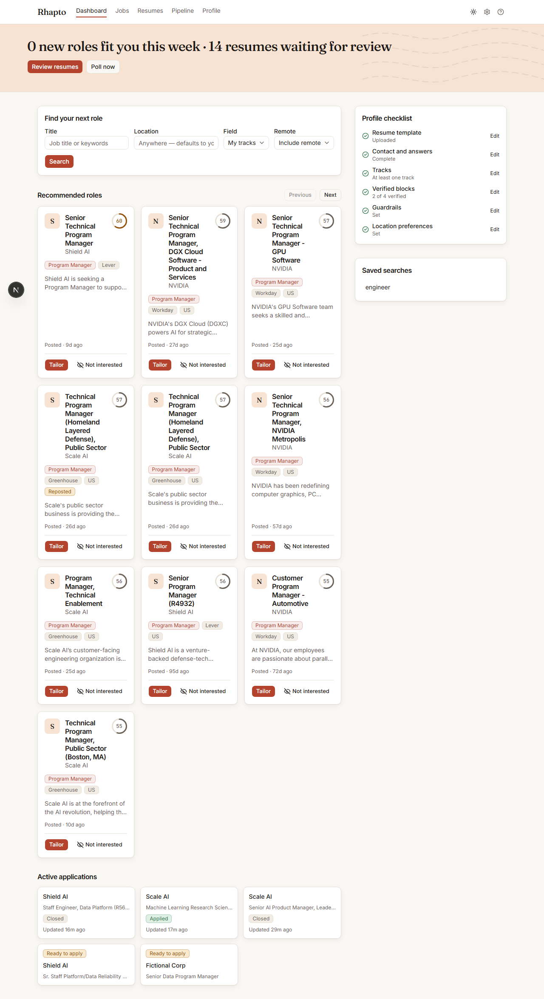
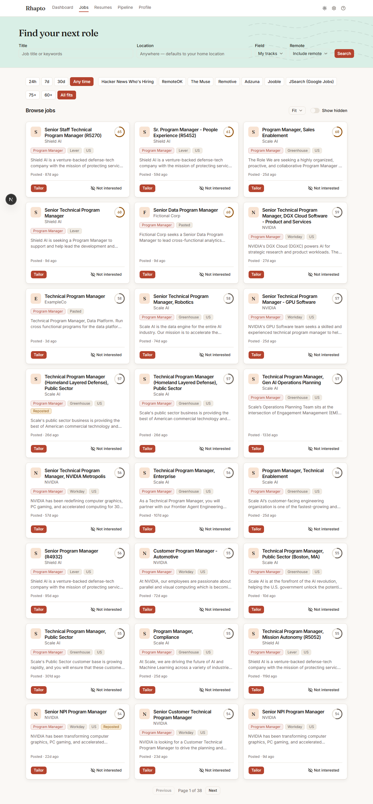

# Getting started

This walks through setting up Rhapto and running your first search, tailor, and review. For what
Rhapto is and isn't before you install it, see [`../product/overview.md`](../product/overview.md).

## Before you start

You'll need Docker (for Postgres, Redis, the API, the worker, and the web app) and a key for one
LLM provider — Anthropic, OpenAI, or Google Gemini.

## Install

```bash
cp .env.example .env            # set RHAPTO_API_TOKEN and your provider key (see below)
docker compose up -d            # db, redis, api, worker, web
open http://localhost:3000
```

Generate a value for `RHAPTO_API_TOKEN` in `.env` (any random string works), and either set your
provider's key there too (for example `ANTHROPIC_API_KEY`) or add it later from Settings, as
described next.

## Connect the browser

On first visit, or any time you change the token, open **Settings → API connection**, paste the
API URL (`http://localhost:8000`) and the bearer token from your `.env`, then **Test connection**
and **Save**. The token is stored only in this browser.

## Upload your resume

Open **Profile → Resume template → Edit** and upload a `.docx`. Uploading a resume document
switches Rhapto to tune mode by default: instead of composing a new resume from a block library,
tailoring edits your own document's wording in place.

## Pick a track

Open **Profile → Tracks → Pick a field and role**. Choose one of the twelve fields, then a role
within it — that creates a track with the role's curated keywords and a fit threshold of 60. If
you've already uploaded a resume, its parsed section titles are matched against role names and
offered as one-tap suggestion chips above the field/role grid.

## Run your first search

Go to **Jobs**, enter a title and (optionally) a location, and press **Search**. Results appear
immediately; jobs that haven't been scored yet show a dashed fit ring while the scorer catches up
— it refetches every few seconds until every job has a score, or up to a minute passes.

## Tailor and review

From a job card, press **Tailor**. Once tailoring finishes, the job page's primary button becomes
**Review** — open it to see the generated resume, then go back to the **Resumes** page and press
**Mark ready** on that row once you're happy with it.

## Apply

Once a package is ready, the job page's primary button becomes **Apply**. Pressing it opens the
employer's own posting in a new tab and downloads the resume — Rhapto never fills out or submits
the employer's form. When you come back to the tab, a "Did you apply?" prompt asks you to confirm.

## Running the tests

From `apps/web`: `pnpm test` runs the unit tests. `pnpm e2e` runs the Playwright flow specs; it
needs the Docker Compose stack up and running with `RHAPTO_LLM_PROVIDER=fake` so tailoring runs
without a real vendor key or network access.




