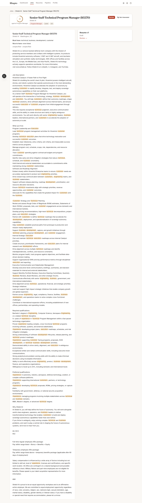

# Jobs and search

Jobs (`/jobs`) is where you search the whole market and browse everything Rhapto has found.

## The search form

The band at the top of the page holds the search form: a free-text **Title**, a free-text
**Location** (it defaults to your home location when left blank), a **Field** select that defaults
to "My tracks" (score against your own tracks rather than one field's generic keyword list), and a
**Remote** select (include, remote only, or exclude remote). Press **Search** to run a live search
across every enabled source; results stream back with unscored jobs showing a dashed ring until
the scorer catches up.

## Filter chips

Below the search band sit three groups of filter chips: **Date posted** (24h, 7d, 30d, any),
**Source** (one chip per enabled source, multi-select), and **Fit** (75+, 60+, or all). Work type
and salary are deliberately not filters in this version — salary shows directly on a card when the
source provides it, but there's no way yet to filter the grid by it.

## Reading a card

Each job card shows: a fit ring (with the score, or a dashed ring and a dash if unscored), the
title and company, a track chip (which track it was scored against, if any), a source chip, a
location-tier chip (Preferred area / Remote / US / Abroad), a Reposted chip when the posting has
reappeared after being unlisted, salary when the source provides it, and "Posted · {relative
time}".

## While the rings are dashed

A freshly returned job that hasn't been scored yet shows `best_fit: null` and a dashed ring. The
page refetches those jobs every 3 seconds until every one has a score, for up to 60 seconds total.
If a job's ring is still dashed after that, scoring simply hasn't finished yet — the dash isn't an
error, and the ring fills in the next time you load the page.

## Sort, Show hidden, Not interested

Above the grid, a **Sort** control switches between Fit (the default) and Newest. **Show hidden**
reveals jobs you've previously marked Not interested, and lets you bring one back. Not interested
on a card hides that job immediately, with an **Undo** toast that stays up for 8 seconds.

Browse jobs pages client-side, 24 per page, with **Previous** / **Next** and "Page X of Y" below
the grid. The current page is part of the URL, so the browser's Back button steps back through
pages one at a time rather than losing your place.

## Save this search

Once you've run a search with a query, a "Save this search" button appears in the band (it's
hidden once the current query is already saved). Saving turns the search into one Rhapto's worker
polls on its normal schedule going forward, and it starts tracking "N new" — new matches since you
last opened its results, shown on the Dashboard's Saved searches rail.

