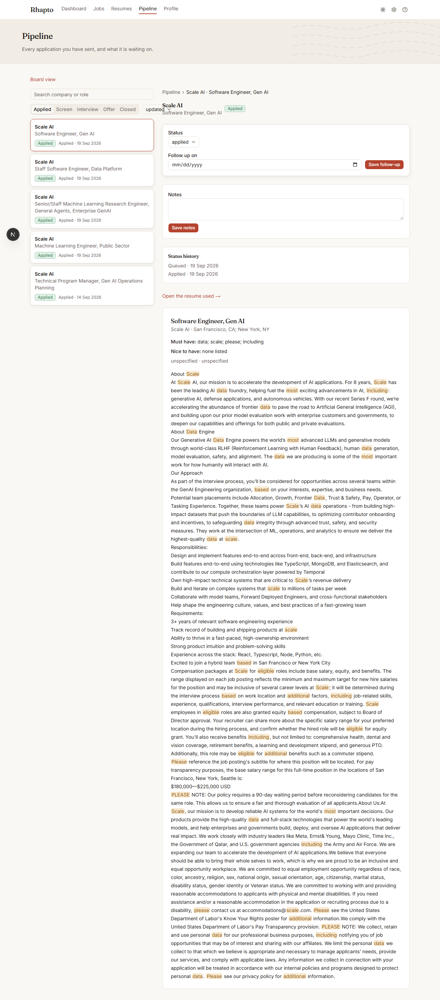

# Pipeline

Pipeline (`/pipeline`) is a list-detail view of every application you've sent, independent of the
resume behind it.

## The list

The left column has a search box (matches company or role), a sort control (Updated, Applied date,
or Company), and five tabs — **Applied · Screen · Interview · Offer · Closed** — matching the
stages an application moves through. Each card shows the company, role, a status pill, the applied
date, and a follow-up chip when one is set.

## The detail pane

Selecting a card on the left opens its detail on the right: a breadcrumb and header, the status
control, a notes box, the status history, a link to the resume that was used, and the job
description.

## Moving a status forward

The status control's Select moves an application through **Applied → Screen → Interview → Offer**
(or straight to Closed). Each change is saved immediately and recorded in the status history below.

## Closing with a reason

Once an application's status is set to **Closed**, a second Select appears for the reason — always
required so a closed application says why:

- **Rejected** — the employer turned you down.
- **Withdrew** — you pulled out of the process.
- **No response** — the employer went quiet.
- **Filled** — the role was filled by someone else, or pulled entirely.

## Follow-ups

The detail pane has a date field for a follow-up. Setting one and pressing **Save follow-up** puts
a reminder on the Dashboard: any follow-up due today (or overdue) shows in Active applications with
a red "Follow up today" chip, whether or not that application would otherwise be one of the three
most recent.

## Notes and history

A free-text notes box saves independently of the status ("Save notes"), and every status change —
including the very first, when the application was created — appears in the status history list
below it with its date.

## The board view

`/pipeline/board` shows the same applications as a drag-and-drop Kanban board, one column per
status (including the earlier `discovered`/`queued` stages that precede Applied). Dragging a card
to a new column patches its status the same way the list-detail status control does; clicking a
card there opens a side sheet with the same status, notes, and history controls, plus a delete
option. A link back to this list view sits above the board.
