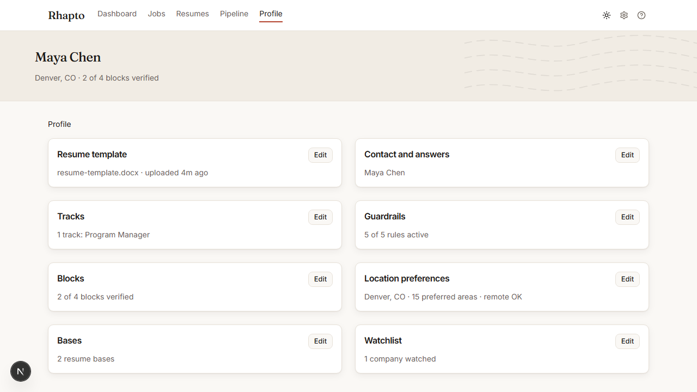

# Profile and tracks

Profile (`/profile`) holds everything Rhapto needs to know about you, as eight summary cards in two
columns. Each card's **Edit** opens a sheet with the full editor; a card can be linked to directly
with `?card=<id>` (for example `/profile?card=tracks`) — the same links the Dashboard checklist
uses. Opening a sheet this way adds a step to your browser history, so the back button closes an
open sheet rather than leaving the page; pressing Back again afterward leaves the page as normal.

## The eight cards

- **Resume template** — the `.docx` Rhapto tunes in tune mode, and what it parsed from it.
- **Tracks** — the roles Rhapto scores jobs against; see below.
- **Blocks** — your library of career facts, the only source a generated resume may draw from.
- **Bases** — named groupings of blocks and section order used to compose a resume in blocks mode.
- **Contact and answers** — name, email, phone, location, links, and any other application-form
  answers Rhapto fills in verbatim.
- **Guardrails** — the rules that can block a generated resume; see below.
- **Location preferences** — your home location, preferred areas, and remote preference.
- **Watchlist** — the company boards Rhapto polls directly; see below.

## Tracks and the field picker

A track is what a job is scored against (see
[`../product/concepts.md`](../product/concepts.md#tracks)). The fastest way to create one is
**Pick a field and role**: choose one of twelve fields (Engineering, Data Science, Product, Program
and Project Management, Design, Marketing, Sales, Finance, Operations, People, Customer Success,
Other), then a role within it. Picking a role creates a track with that role's curated keywords and
a fit threshold of 60. If you've uploaded a resume, its parsed section titles are matched against
role names and offered as one-tap suggestion chips above the field/role grid — picking one skips
straight to that role. Once created, a track's name, keywords, and threshold all stay editable in
the same Tracks card.

## Blocks and verified metrics

Only a block marked `verified: true` may carry a `metric`. The guardrail validator enforces this at
generation time, so an unverified number simply cannot make it into a resume — mark a block
verified only once you're confident the number is accurate, since doing so is what lets Rhapto use
it.

## Guardrails

The Guardrails card lists the active rule set (Rhapto ships sensible defaults; you can add, edit,
or turn any of them off). Turning off a rule like "no unverified metrics" or "no invented entities"
prompts a confirmation first, since it directly weakens what the guardrail panel can catch on a
generated resume.

## Location preferences

Three answers drive fit's location multiplier: your home location, a comma-separated list of
preferred towns and regions, and whether remote roles are acceptable to you. Saving any of them
re-scores your queue immediately.

## Watchlist

The Watchlist card lists the company boards Rhapto polls directly — company, source (Greenhouse,
Lever, Ashby, Workday, or one with no adapter yet), the board identifier, and optional keywords.
Add a row by hand with **Add row**, or let Rhapto add one for you: when a live search turns up a
job hosted on a company's own ATS board, that board is added to your watchlist automatically. See
[`../product/sources.md`](../product/sources.md#auto-discovered-boards) for the URL patterns Rhapto
recognizes.
