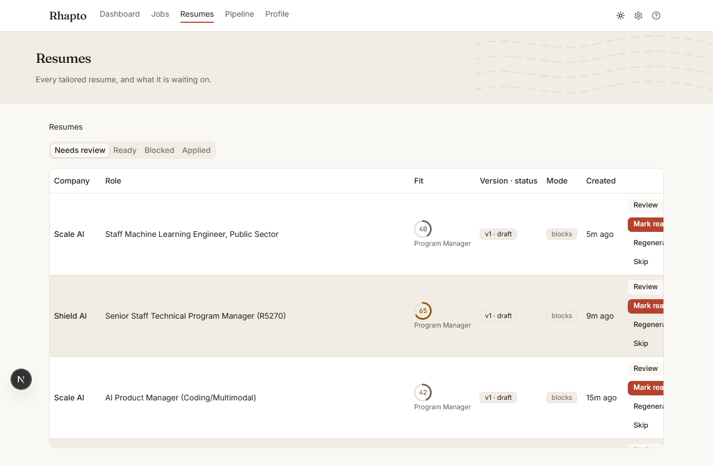
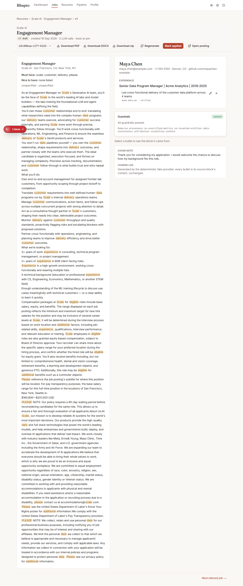

# Resumes

Resumes (`/resumes`) lists every tailored package and what it's waiting on.

## The four tabs

- **Needs review** — freshly tailored, not yet marked ready.
- **Ready** — you've reviewed it and marked it ready to apply.
- **Blocked** — a guardrail rejected something in it; it needs a fix before it can be ready.
- **Applied** — the resume behind an application you've already sent.

## Reading a row

Each row shows the company, role, a fit ring with the track it was scored against, a "v{version} ·
{status}" pill, a mode chip (blocks or tune), when it was created, and row actions on the right.

## Review

Opening Review takes you to the package's own page, with the job description alongside. What you
see depends on the package's mode:

- **Blocks mode** shows the composed resume section by section; selecting any bullet shows the
  source block it came from, so you can see exactly which fact it traces to.
- **Tune mode** shows the **Changes** pane: one card per paragraph your resume was rewritten,
  each with a **Before / After** word-level diff — added words underlined, removed words struck
  through — so you can see exactly what changed rather than re-reading the whole document. You can
  edit any "After" directly (click into it to get a text box) and press **Save as new version**,
  which re-runs the guardrails and creates a fresh version rather than overwriting the one you're
  looking at.

Either way, the page also shows the cover note, the change log, and (once a package is blocked) the
guardrail panel described below.

## Mark ready

Once you're satisfied with a package, go back to the Resumes table and press **Mark ready** on its
row (it's only offered on rows that still need review). This is the review page's own way forward
described in [`../product/flow.md`](../product/flow.md) — reviewing happens on the package page,
but marking ready happens from the table.

## Regenerate

**Regenerate** opens a dialog where you can add feedback (10–500 characters), switch the track, and
switch the mode (tune is only offered once you have a resume document on file) — then re-tailors
into a brand-new version rather than editing the current one. You'll find Regenerate both as a row
action on the Resumes table and as a button on the package review page.

## Skip

**Skip** archives the package and hides its job in one step, exactly like the job page's own Skip.
An **Undo** toast stays up for 8 seconds if you change your mind.

## Blocked

A blocked package failed at least one guardrail rule. The guardrail panel lists every violation:
which rule failed, a plain-language message, and the exact path into the resume it applies to —
click one to jump straight to it. A metric is rejected, for instance, when it doesn't trace back to
a block marked `verified: true` (see [`../product/concepts.md`](../product/concepts.md#verified-metrics));
edit the offending bullet or paragraph and save a new version, or regenerate, to clear it.

