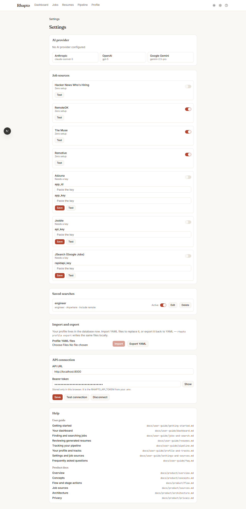

# Settings and sources

Settings (`/settings`) holds everything about how Rhapto connects to the outside world: your LLM
provider, job sources, saved searches, profile import/export, and the browser's connection to the
API.

## AI provider

Pick a provider card (Anthropic, OpenAI, or Google Gemini), paste an API key, choose a model (or
"Other" to type a model id), then **Test connection** to confirm it works before **Save**. Once
saved, the key is never sent back to the browser — the form shows only its last four characters as
a hint. If nothing is configured here, Rhapto falls back to whatever provider key is set in `.env`
on the server.

## Job sources

Each source appears as its own row with an enable switch that saves the instant you flip it. A
source that needs a key shows password-masked fields for it; **Save** posts the key, and **Test**
confirms Rhapto can reach the source with it. A source's status line reads one of three ways:
**Zero setup** (no key needed), **Needs a key** (on, but nothing saved yet), or **Key saved**. A
saved key is never shown back to you — there's nothing to reveal, by design.

## Saved searches

Every saved search — whether you saved it yourself from the Jobs page, or Rhapto derived it from
one of your tracks — appears as a row with its keywords, location, and remote setting. An **Active**
switch pauses or resumes polling for that search without deleting it; **Edit** opens a sheet to
change its name, keywords, location, or remote setting; **Delete** removes it for good (with a
confirmation).

## Import and export

Your profile lives in the database, not in files on disk, once Rhapto is running — but you can
still work with it as YAML. **Import** uploads one or more of the five profile files (`blocks.yaml`,
`tracks.yaml`, `guardrails.yaml`, `answers.yaml`, `watchlist.yaml`) and replaces the matching part
of your stored profile. **Export YAML** downloads the same files as a zip, matching what
`rhapto profile export` writes from the command line.

## API connection

The API URL and bearer token the browser uses to talk to Rhapto's API — stored only in this
browser, nowhere else. **Test connection** confirms the token works; **Disconnect** clears it and
the local cache.

## Help

The Help section at the bottom of Settings links every page of this user guide and the product
docs by name, so you can always find your way back here from inside the app.
